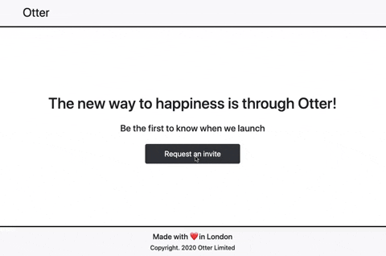

# React Homepage 💻



A single-page React app that allows users to submit a form requesting an 'invite'. If user input is validated then the form makes a POST request to an API endpoint. This project was bootstrapped with Create React App.

Technologies used: *React, React Bootstrap*

## Installation Instructions

1. Fork this repository, clone to your local machine then change into the directory:
```
$ git clone git@github.com:davmcgregor/react-homepage.git
$ cd react-homepage
```
2. Load dependencies and run the app 
```
$ npm install
$ npm start
```
3. Open [http://localhost:3000](http://localhost:3000) to view it in the browser.

## Further Improvements

* Add more comprehensive testing
* Refactor return statement to have conditional parts
* Rebuild the form using [Formik](https://jaredpalmer.com/formik/docs/overview) - especially validation UI
* Improve styling for mobile devices

